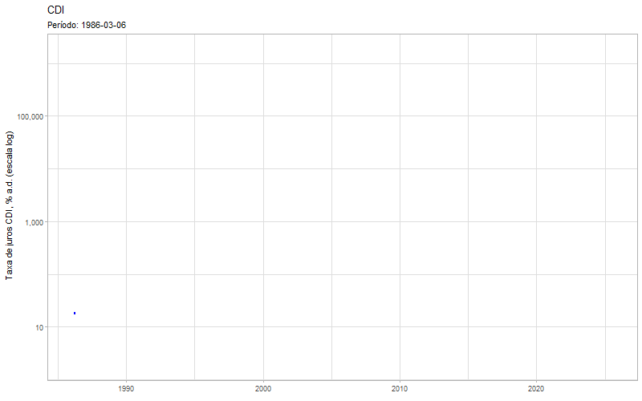

---
title: "Análise CDI"
author: "Nathaly R Hermann"
date: "2025-05-31"
output: 
  html_document:
    toc: true
    toc_float: true
    number_sections: true
    theme: cosmo
---

```{r setup, include=FALSE}
# Carregar pacotes necessários
library(GetBCBData)
library(tidyverse)
library(ggplot2)
library(gganimate)
library(gifski)
library(transformr)
library(scales)

# Importar dados do CDI (descomente para rodar)
# my.id <- c(cdi = 4389)
# df.bcb <- gbcbd_get_series(
#   id = my.id,
#   first.date = '1986-03-06',
#   last.date = Sys.Date(),
#   format.data = 'long',
#   use.memoise = TRUE,
#   cache.path = tempdir(),
#   do.parallel = FALSE
# )
```

# Análise CDI

## Introdução

O acompanhamento das taxas de juros é fundamental para entender o comportamento do mercado financeiro e seus impactos na economia. Entre essas taxas, destaca-se o **CDI (Certificado de Depósito Interbancário)**, que é amplamente utilizado como referência para diversas operações financeiras, como empréstimos, financiamentos e investimentos no Brasil.

O CDI reflete o custo das transações de crédito entre instituições financeiras e está diretamente relacionado à taxa básica de juros da economia (Selic). Compreender sua evolução ao longo do tempo é essencial tanto para analistas financeiros quanto para investidores.

## Sobre o Gráfico

O gráfico apresentado a seguir mostra a evolução histórica da taxa CDI em uma escala logarítmica. Essa abordagem permite uma visualização mais clara das variações percentuais ao longo do tempo, especialmente quando há mudanças significativas nos patamares da taxa.

A animação tem como objetivo ilustrar, de forma dinâmica, como a taxa CDI se comportou no período analisado. A linha se desenha progressivamente conforme avança o tempo, permitindo observar os movimentos de alta e baixa de forma mais intuitiva.

## Gráfico Animado

```{r grafico-cdi, echo=FALSE, out.width="100%"}
# Criando o gráfico (descomente após baixar os dados)
# p <- ggplot(df.bcb, aes(x = ref.date, y = value)) +
#   geom_line(color = "blue") +
#   scale_y_log10(labels = comma) +
#   labs(
#     title = "CDI ao longo do tempo",
#     subtitle = 'Período: {frame_along}',
#     x = "Data", 
#     y = "Taxa de juros CDI, % a.d. (escala log)"
#   ) +
#   theme_light() +
#   transition_reveal(ref.date)

# Gerando o GIF
# animate(p, duration = 10, fps = 20, width = 800, height = 500, renderer = gifski_renderer("grafico_cdi.gif"))

# Inserindo o GIF no documento

```

## Conclusão

Por meio da análise da taxa CDI apresentada, é possível perceber as flutuações que ocorreram ao longo do tempo, refletindo os ciclos econômicos, as políticas monetárias adotadas pelo Banco Central e os cenários macroeconômicos nacionais e internacionais.

A utilização da escala logarítmica facilita a percepção de variações relativas, evidenciando tanto períodos de estabilidade quanto de maior volatilidade. A animação contribui para reforçar essa percepção, oferecendo uma visão temporal contínua dos dados.

Compreender o comportamento da taxa CDI é fundamental para tomada de decisões financeiras, tanto no âmbito corporativo quanto pessoal, visto que ela impacta diretamente os custos de crédito, investimentos e outros instrumentos financeiros no mercado brasileiro.
